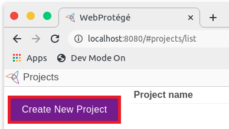
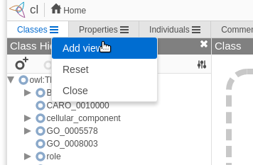
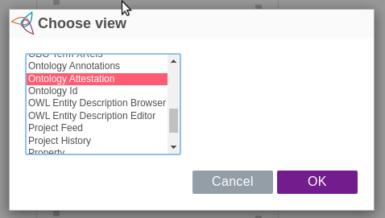
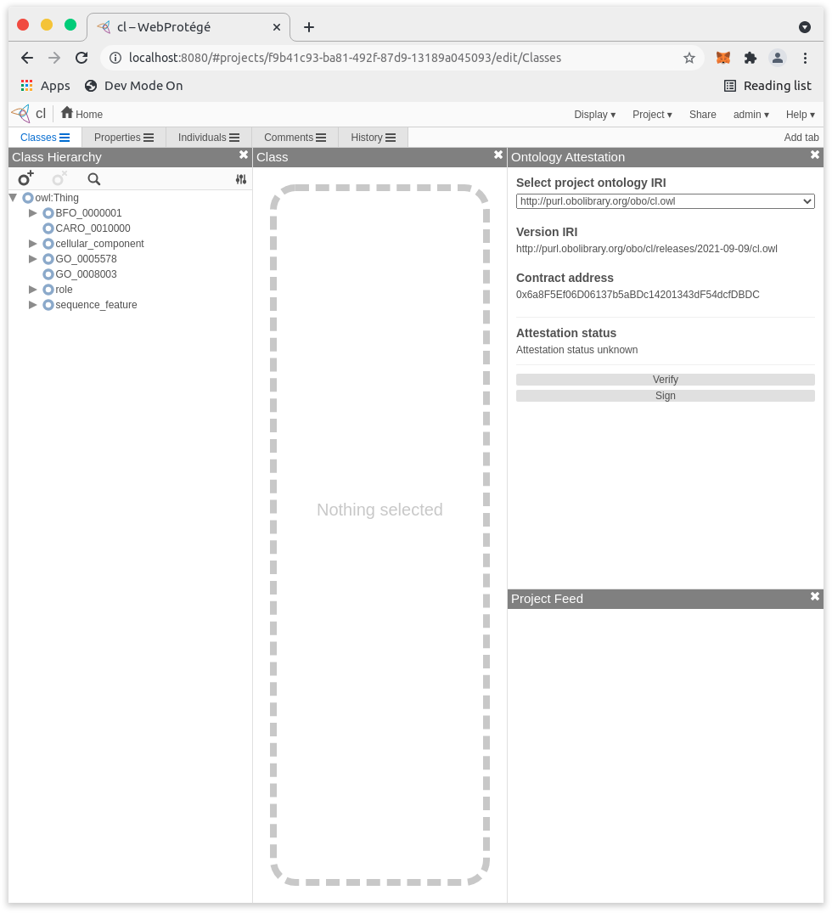
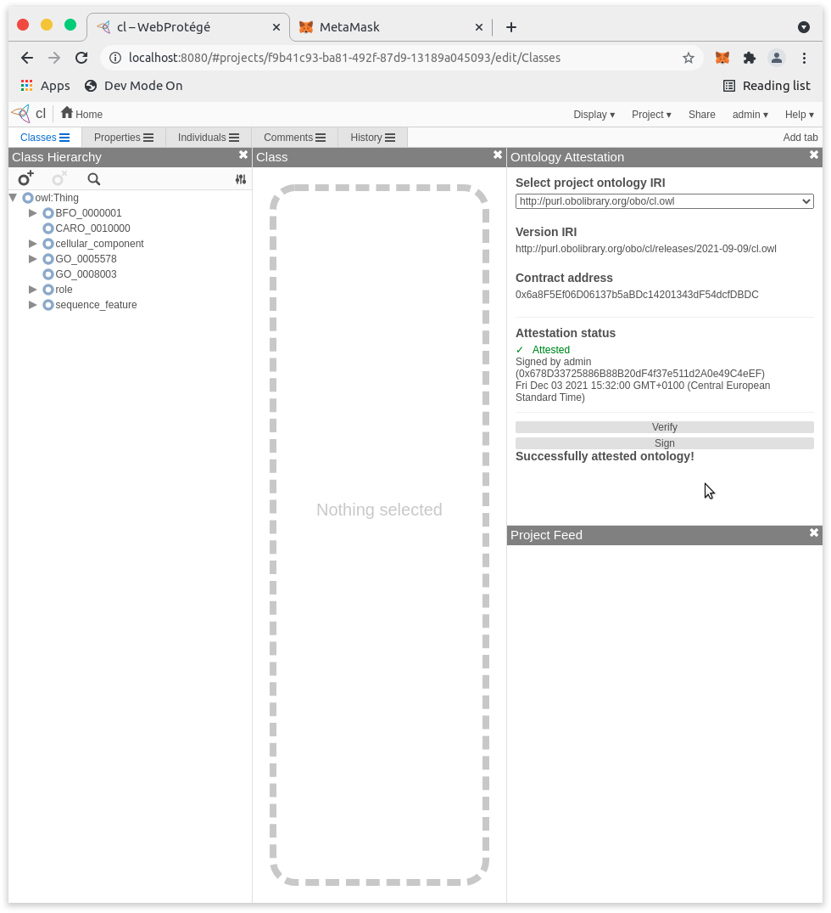

# How to use the attestation extension

Requirements (see the installation instructions):
- Running WebProtégé instance (either as Docker container or using Maven).
- Deployed contracts (either in a local test blockchain, e.g., in Ganache or on a public network).
- [Metamask](https://metamask.io/) plugin for your browser.

## Setting up Metamask
1) Install the Metamask plugin for your browser. You may follow the [Metamask installation guide](https://metamask.zendesk.com/hc/en-us/articles/360015489531-Getting-started-with-MetaMask).
2) Open the extension and login to your account (if you hvae one) or create/import a new one by entering a Mnemonic (Secret Recovery Phrase). If you use the Ganache instance chose "Import wallet" and enter the Mnemonic phrase found in the `docker-compose.yml` file. The Mnemonic is a phrase of 12+ lower-case words.
3) If using a local blockchain, e.g., the Ganache instance configured in the `docker-compose.yml` file, you need to add a custom network as explained here: https://metamask.zendesk.com/hc/en-us/articles/360043227612-How-to-add-a-custom-network-RPC. For the Ganache instance, enter following values:
```
    RPC Url: localhost:
    Chain ID: 1
```
4) Switch to the network where the contracts are deployed (e.g., localhost for Ganache)

## Attesting to the provenance of an ontology in WebProtégé

1. Log into WebProtégé (by default https://localhost:5000 when using docker or https://localhost:8080 in DevMode) and import an Ontology, e.g., download one from [BioPortal](https://bioportal.bioontology.org), by pressing "Create new project".

1. Open the project and add a new view by clicking the menu icon of a tab and selecting "Add new view".

A popup appears. Select the portlet named "Ontology Attestation". Then place the view on the screen.

1. In the attestation panel (here on the right) select the IRI of the ontology to attest (the IRIs of imported ontologies are shown as well) with the dropdown menu.

1. Once an IRI is selected an attestation may be started by clicking "Sign". Metamask will then prompt to log in. If the popup does not appear, click the Metamask icon on the Plugin bar of your browser.

1. After unlocking Metamask a transaction request is shown. Make sure you have selected the correct network (see previouse section). Authorizing the transaction closes the popup and the result is displayed in the attestation panel.

